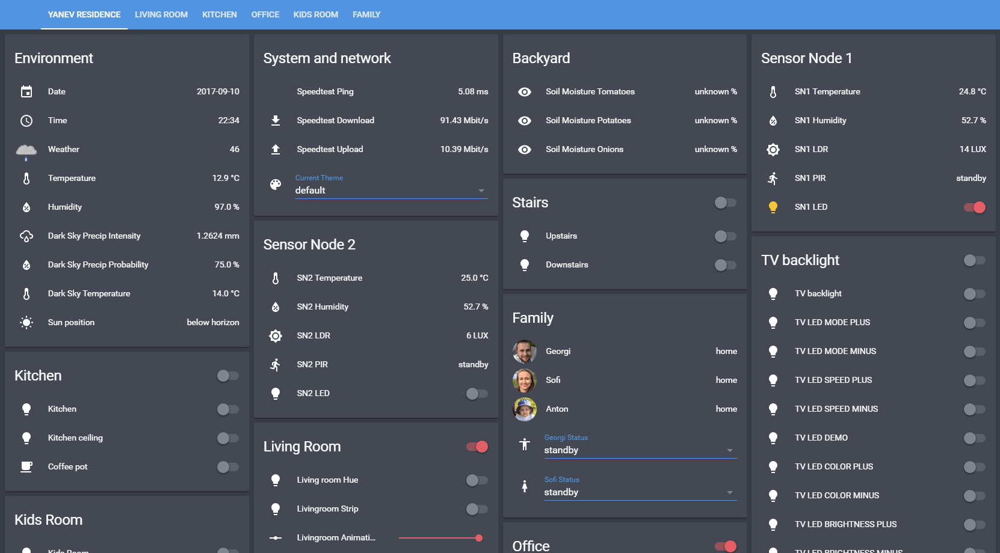

# YAR Home Assistant Configuration

The `YA`nev `R`esidence (YAR) configuration for [Home Assistant](https://home-assistant.io/)

## Device / Sensor list:

- [Google Home](https://goo.gl/rE8rmp)
- [Amazon Echo Dot 2nd Gen](https://amzn.to/2x6Dpus)
- [Philips Hue](https://amzn.to/2haOccI)
- [IKEA Tradfri](https://goo.gl/tFJ3nS) bulbs
- [IKEA Tradfri](https://goo.gl/tFJ3nS) motion sensors
- [Chromecast 1 and 2](https://goo.gl/ACypXo)
- Generic IP Camera
- Android phones as IP cameras
- [Raspberry PI 3 Model B](https://amzn.to/2hbEFCx)
- Many [ESP8266](https://goo.gl/ifT5X9) chips on NodeMCU boards
- [Arduino Leonardo](https://goo.gl/npGkYF)
- [Arduino Nano](https://goo.gl/FrsYyP)
- [Raspberry PI Zero](https://amzn.to/2hbFE5H)
- [DHT22 Temperature and Humidity sensors](https://goo.gl/CN7Adp)
- [TEMT6000 LUX sensors](https://goo.gl/PV9EDn)
- [TSL2561 LUX sensors](https://goo.gl/BEuFuh)
- [DS18B20 Temperature sensors](https://goo.gl/R7pGdD)
- [WS2812B Addressable LED strips](https://goo.gl/TKxsbd)
- [PIR sensors](https://goo.gl/YMYb1d)
- Main computer
- Smart TV
- [433 MHz RF outlets](https://goo.gl/VyJa4h)
- 433 MHz RF led strips
- 433 MHz RF door sensors

## Automations:

- LUX based switching on and off of lights
- Time based weekday switching off of house
- Weekday morning coffee automatic preparation
- Switch on devices on arrival at home
- More coming soon...
- ...

## Interfaces:
- Wall mounted android device
> unlocks with a wave gesture, displays Home Assistant UI

- iPad
> iOS Home Assistant app

- iPhone, Google Nexus 6P
> personal use

- Amazon Echo
> Alexa has complete access over the entire set of devices and sensors through an Emulated Hue component in Home Assistant.

- Google Home
> Currently Google Assistant's implementation relies entirely on IFTTT hooks to Home Assistant through the IFTTT Maker channel, which is less than optimal, but will hopefully change in the near future. Supports lights, accents, scenes, etc.

## Working on / Coming soon:
- Waterproof soil moisture sensors on a NodeMCU with a battery
- Ceiling led lighting with and without ws2812b strips
- Scene switcher with a numeric keypad
- Make the ISS paper model move with servos and fishing cord
- Paint, hang and make planets (Mars, Jupiter, Pluto) and moons (Europa, Enceladus, Titan) styrofoam models move with servos
- Window blinds
- More coming soon...

### Social Links

- [www.georgi-yanev.com](https://www.georgi-yanev.com)
- [blog.georgi-yanev.com](https://blog.georgi-yanev.com)
- [Facebook](https://www.facebook.com/jumpalottahigh/)
- [Twitter](https://www.twitter.com/jumpalottahigh/)
- [LinkedIn](https://www.linkedin.com/in/yanevgeorgi/)
